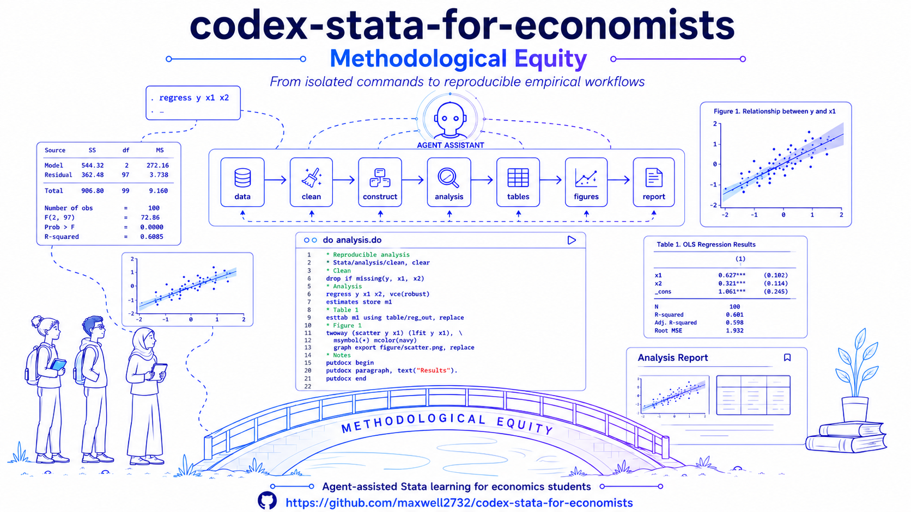

<p align="center">
  <a href="https://doi.org/10.5281/zenodo.19902598">
    
  </a>
  <a href="README.md">
    
  </a>
  <a href="README.en.md">
    
  </a>
</p>

<p align="center">
  
</p>


# 面向经管专业的 Stata 可复现 Codex 工作流

**作者：** 朱 晨 | 遗传社科研究 Chen Zhu | China Agricultural University (CAU)

**最后更新：** 2026-07-19

**致谢：** [@shy7890](https://github.com/shy7890)（bug修复）

这是一个为经济学实证研究准备的 Stata 工作流。核心目标是让一个研究项目从原始数据、清洗、变量构造、模型估计，到表格、图形和 Quarto 报告，都能被稳定复现、被日志验证，并且适合由 Codex 协助维护。

本仓库原本包含 Claude Code 配置；现在已经改为 **Codex 优先、Claude Code 兼容** 的结构。Codex 进入项目后应优先读取 `AGENTS.md`，原有 `.claude/` 和 `CLAUDE.md` 保留用于兼容 Claude Code，也可作为更详细的规则参考。

生成的 Stata 代码及图表示例：

<p align="center">
  
  
</p>

<p align="center">
  
  
</p>


<p align="center">
  
  
</p>

---

## 项目理念：方法平权 —— 但前提是你要动起来

我做这个项目背后的一个基本想法是：**统计和计量方法不应只属于少数已经熟悉软件、代码和研究流程的人。**

在传统课堂中，学生常常不是因为不理解某个统计概念而停下来，而是卡在更具体、更琐碎的地方：数据放在哪里、do-file 怎么组织、log 怎么看、回归结果怎么导出、图表怎么生成、报告怎么复现。这些技术门槛会逐渐扩大方法学习的差距，使一部分学生还没真正进入实证研究，就已经被软件和流程挡在门外。

Agent 在这里的意义是降低进入方法训练的起点。它可以帮助学生把零散命令组织成完整流程，把错误暴露在日志中，把表格、图形和报告纳入可复现的 pipeline。让学生在 Agent 的陪伴下真正进入统计、计量和可复现研究的实践。

但这种方法平权有一个前提：**你必须动起来。**

如果只是**一直在旁观 AI、收藏工具、犹豫行动、等待别人的测评结果**，那么再强的 Agent 也没有意义。你会在这波浪潮中被落下。

所以别犹豫，现在就开始使用，收获自己的第一手经验！

---

## 快速上手指南

> 在开始之前：必须已安装 Codex，Stata，Python 3 （或 Miniconda）和 git（同时注册 GitHub 账号）。强烈建议安装 Quarto，用于渲染可复现 HTML/PDF 报告；如果你已经安装 RStudio，也可以先使用 RStudio 自带的 Quarto。

### Step 1. Fork & Clone

```bash
# 在 GitHub 上克隆此仓库（在仓库页面点击“ Fork ”），然后：
# （ 将“ YOUR_USERNAME ”替换为你自己的 GitHub 用户名 ）

git clone https://github.com/YOUR_USERNAME/codex-stata-for-economists.git my-codex-stata-for-economists
cd my-codex-stata-for-economists
```
也可以将本仓库下载（zip文件），本地解压缩。但这种方法无法进行版本控制，故不太推荐。

### Step 2. 打开 Codex 并复制粘贴以下指令

```bash
# 确保已进入本地仓库目录下，如 C:\my-codex-stata-for-economists， 然后启动 Codex ：

codex
```

将准备进行分析的 *.dta 数据文件放入到 `data/raw/` 文件夹中，然后根据自己需求修改以下 Prompt 并复制粘贴到 Codex 中：


> 我把数据 **[Data NAME.dta]** 放到 data/raw/里了，请阅读 Agents.md 等 configuration files ，根据规则帮我用 Stata 进行分析，生成 **[描述性统计、直方图、散点图、方差分析、OLS、工具变量回归、Logit回归结果]**，代码存成一个 do file，并且加上详细的中文代码注释，方便我之后复现。生成的图表保存在 output/ 中。


**该 Prompt 用途：** Codex 会阅读仓库中的工作流配置文件，调取相应 Stata Skills，计划并实施 Stata 分析流程，生成结果并验证.

**如果 Codex 中途困在寻找 Python 和 Stata：** 按 Esc 暂停，并告诉 Codex 你的 Python 和 Stata 版本及所在位置。

> **工作流说明：** 上面的单文件 Prompt 适合快速教学演示。对于尚未定稿的真实研究，
> 应优先使用下面的 exploration workflow，不要直接把测试代码写入生产 `dofiles/`
> 或把测试结果写入根 `output/`。

### 推荐使用流程与提示词模板

一个研究项目通常经历“启动探索—迭代调试—稳定重构—晋升审计—正式迁移”五个阶段。
提示词不需要逐条指定 Stata 命令放在哪个 `.do` 文件；你可以先说明研究问题、数据和
分析目标，要求 Codex 提出文件编排方案。样本筛选、变量含义、模型设定、固定效应和
标准误聚类层级等实质选择应由 Codex 明确说明，不能静默替你决定。

#### 1. 启动 exploration

```text
请阅读 AGENTS.md 和 README.md。新建 exploration：<项目名>。
数据位于 <数据路径>，研究问题是 <研究问题>，计划进行 <分析内容>。
请先检查数据，并提出 do-file 的用途、输入、输出和执行顺序，再开始实施。
建立 README.md、dofiles/、logs/、output/tables/ 和 output/figures/。
所有测试日志和结果保存在该 exploration 内，不要修改生产 dofiles/00_master.do。
```

#### 2. 只调试当前问题

```text
请只在 explorations/<项目名>/ 中调试 <具体问题或模型>。
单行检查和迭代调试默认使用 stata-mcp；需要文件级测试时，只运行解决该问题所需的 do-file。
不要运行完整生产 pipeline，也不要修改生产文件。
检查最新日志和输出表格后再解释数值结果。
```

在 exploration 阶段，Codex 默认用 `stata-mcp` 直接执行单行检查、查看当前数据和
迭代调试，不会仅为执行一行命令而新建临时 `.do` 文件。确认有效的分析命令仍须写回
exploration 内的正式 `.do` 文件。MCP 会话带有当前数据、宏、筛选和估计结果等状态，
因此只用于快速诊断，未保存的交互式输出不能作为最终数值依据。

当 exploration 的 `.do` 文件稳定后，应通过仓库批处理命令在全新的 Stata 进程中运行
该独立文件，以验证它不依赖 MCP 会话状态。晋升生产及最终验证继续使用批处理，并在
适用时完整运行 `dofiles/00_master.do`。MCP 与批处理不得同时写入同一日志、数据文件、
表格或图形。如果当前 Codex 会话没有加载 `stata-mcp`，Codex 应明确说明，不能在未告知
用户的情况下改用 CMD、批处理或临时 `.do` 文件。

##### 如何获得接近 Stata GUI 的手动体验

stata-mcp 项目主页：<https://github.com/hanlulong/stata-mcp/tree/main>

`stata-mcp` 不要求用户预先打开传统的 Stata Desktop 窗口。安装扩展并打开 VS Code
后，扩展默认自动启动本地 MCP 服务；状态栏显示 `Stata` 表示服务已经启动。用户可以
在 VS Code 内完成接近 Stata Command、Results、Data Editor 和 Graph 窗口的交互操作：

1. 打开一个 `.do` 文件，把光标放在需要执行的行，或选中一段 Stata 代码。
2. 按 `Ctrl+Shift+Enter`，或点击编辑器工具栏的运行按钮，执行当前行或选中代码。
3. 在 **Stata Output** 面板查看命令和结果；使用命令面板中的
   **Stata: Show Output** 可以重新打开该面板。
4. 使用 **Stata: Interactive Mode** 打开交互窗口，像在 Stata Command 窗口中一样
   逐条输入命令。当前数据、宏、程序和估计结果会在同一会话中继续保留。
5. 使用 **Stata: View Data** 以表格形式查看当前内存数据，并可输入 Stata `if`
   条件筛选显示的观测。
6. Stata 命令生成图形后，图形默认显示在 VS Code 面板中；也可以在扩展设置中把
   `stata-vscode.graphDisplayMethod` 改为 `browser`，使用外部浏览器显示。
7. 需要清空状态并重新开始时，在命令面板运行 **Stata: Restart Session**。这会清除
   内存数据、globals 和 programs，效果相当于关闭后重新打开一个 Stata 会话。

运行整个当前 `.do` 文件可按 `Ctrl+Shift+D`，停止正在执行的命令可按
`Ctrl+Shift+C`。如果编辑器工具栏没有显示相关按钮，可以按 `Ctrl+Shift+P` 打开命令
面板，搜索以 `Stata:` 开头的命令。详细操作与最新快捷键以
[stata-mcp 官方 README](https://github.com/hanlulong/stata-mcp/tree/main#usage) 为准。

VS Code 中手动运行的会话、Codex 通过 MCP 调用的会话，以及用户另外打开的传统 Stata
GUI 窗口可能是相互独立的。启用多会话模式时，不应假设它们自动共享数据、宏或估计
结果。为使 VS Code 中手动运行当前行或选中代码后，Codex 可以继续使用相同的内存
状态，本项目规定 Codex 默认显式使用 `session_id="default"`。只有用户明确要求隔离或
并行执行时，Codex 才能创建命名会话，并须向用户说明该会话 ID。

运行 **Stata: Restart Session** 会重启并清空 `default` 会话中的数据、宏、程序和估计
结果，但不会自动销毁已经创建的其他命名会话。用户另外打开的传统 Stata GUI 窗口仍
是独立进程，不与 MCP 的 `default` 会话共享内存状态。

#### 3. exploration 变复杂后再考虑拆分

```text
当前 exploration 已经较复杂。请先提出 do-file 拆分建议，说明每个文件的职责、
输入、输出和依赖顺序，暂不修改文件。拆分必须保持现有样本、模型和结果不变。
如确有必要，可建议增加 exploration 内部的 dofiles/00_run_all.do。
```

仓库没有规定一个模型或一类命令必须单独占用一个 `.do` 文件。单文件 exploration
完全合规；是否拆分取决于运行时间、依赖关系、局部重跑需要和可读性。
`00_run_all.do` 也是可选的，只用于协调同一 exploration 内的多个文件，不能代替生产
`dofiles/00_master.do`。

#### 4. 定稿前进行晋升审计

```text
请对 explorations/<项目名>/ 做 production promotion audit，暂不迁移。
检查：数据和变量定义、样本限制、模型设定、日志错误、结果可追溯性、输出格式、
数据安全、README 复现说明和质量评分。列出尚未达到生产要求的项目。
```

#### 5. 明确授权晋升生产

```text
explorations/<项目名>/ 已经定稿，请晋升到生产 pipeline。
将代码按职责迁移到 dofiles/01_clean/、02_construct/、03_analysis/ 和 04_output/，
把日志和结果路径改为根 logs/ 与 output/，并按依赖顺序接入 dofiles/00_master.do。
不要改变未经授权的样本或模型设定。分别运行迁移后的单个文件和完整 pipeline，
比较迁移前后的样本量、核心系数和输出，说明所有差异。
```

只有第5类提示词明确授权修改生产 `dofiles/00_master.do`。仅说“试一下”“调试”或
“增加一个模型”时，代码应继续留在 exploration 中。

---

## 这个仓库做什么

本仓库提供一套 Stata 实证研究流水线：

- 原始数据放在 `data/raw/`，默认不提交。
- 中间数据放在 `data/derived/`，默认不提交。
- 主流水线入口是 `dofiles/00_master.do`。
- 正式 do-file 按阶段放入 `dofiles/01_clean/` 到 `dofiles/04_output/`。
- 表格输出到 `output/tables/`。
- 图形输出到 `output/figures/`。
- 报告使用 `reports/analysis_report.qmd`，通过 Quarto 渲染；正式分析默认同时生成英文版和中文版报告，例如 `analysis_report.qmd` 与 `analysis_report_zh.qmd`。
- 探索性分析、教学示例和一次性实验放在 `explorations/`。

---

## 支持的分析类型

本仓库默认支持常见 Stata 实证分析流程，包括描述统计、图形、OLS、固定效应回归、IV、事件研究、DID、DDML 和 Cox hazard ratio / 生存分析示例。正式分析通常放在 `dofiles/03_analysis/`，并通过 `dofiles/00_master.do` 串联到完整流水线；尚在测试或教学阶段的方法先放在 `explorations/`。

当前 DID/DDML 支持包括：

- 基础 DID / TWFE：使用 `reghdfe` 吸收个体和时间固定效应，并按处理分配层级聚类标准误。
- Staggered DID：模板支持 `csdid` 估计 Callaway-Sant'Anna group-time ATT、总体 ATT、pre-trend 检查和事件研究输出。
- DDML：模板支持 `ddml + rlasso` 的部分线性模型，适合 Stata 15；Stata 16+ 且配置 Python/scikit-learn 后，可切换到 `pystacked` 学习器。
- Cox hazard ratio / 生存分析：`explorations/cox_hazard_ratio_simulation/` 提供自包含模拟示例，展示 `stset`、`stcox, hr`、比例风险假设诊断和生存曲线导出。正式研究需要使用真实 time-to-event 变量时，可在确认变量定义后迁入 `dofiles/03_analysis/`。
- 依赖管理：`dofiles/00_master.do` 会记录 DID/DDML 命令是否可用；首次使用时可把 `local INSTALL_DEPS = 1` 打开安装核心包，安装后改回 `0`。

可复制模板：

- `templates/did-analysis-template.do`：复制到 `dofiles/03_analysis/05_did.do` 后替换变量名即可使用。
- `templates/ddml-analysis-template.do`：复制到 `dofiles/03_analysis/06_ddml.do` 后替换变量名即可使用。

---

## Codex 使用说明

Codex 的主说明文件是：

```text
AGENTS.md
```

Codex 后续维护本仓库时应遵守这些规则：

- 不改变 Stata 流水线的功能，除非用户明确要求。
- 新增或修改 Stata do-file 时，注释默认使用中文。
- 所有数值结论必须能追溯到 `logs/*.log` 或 `output/tables/*`。
- 没有日志或输出表格支撑时，不编造回归结果、标准误、样本量或描述统计。
- 不提交 `data/raw/`、`data/derived/`、Stata 日志或原始数据格式文件。
- 维护 `.gitignore` 的数据保护规则，不随意放松。
- 对 `.do`、`.qmd`、用户可见 Python 脚本做实质修改后，尽量运行质量检查。

Claude Code 兼容文件仍然存在：

- `CLAUDE.md`：Claude Code 的项目记忆入口。
- `.claude/`：Claude Code 的 agents、skills、rules、hooks。

这些文件不影响 Codex 使用。除非确定以后完全不使用 Claude Code，否则建议保留。

---

## 四个核心保证

| 保证 | 执行方式 |
|---|---|
| 可复现 | do-file 固定 Stata `version`，统一随机种子，使用相对路径，流水线从 `00_master.do` 启动 |
| 日志验证 | 数值结论必须来自 Stata log 或输出表格；无日志则不报告结果 |
| 数据保护 | `.gitignore` 阻止 raw/derived 数据、Stata 日志和数据文件误提交 |
| 发表级输出 | 表格和图形使用可审计、可复现的项目标准；描述统计与回归表的具体格式以 `.claude/skills/build-tables/SKILL.md` 为准，图形由 Stata 原生导出为 PDF 和 PNG |

---

## 目录结构

```text
.
├── AGENTS.md                       # Codex 主说明文件
├── CLAUDE.md                       # Claude Code 兼容说明
├── MEMORY.md                       # 旧 Claude 工作流的长期记忆
├── .claude/                        # Claude Code agents、skills、rules、hooks
├── dofiles/
│   ├── 00_master.do                # 主流水线入口
│   ├── 01_clean/                   # 原始数据清洗
│   ├── 02_construct/               # 变量构造和样本构造
│   ├── 03_analysis/                # 回归、IV、DID、事件研究等
│   ├── 04_output/                  # 表格和图形汇总输出
│   └── _utils/                     # 可复用 Stata 工具代码
├── data/
│   ├── raw/                        # 原始数据，不提交
│   ├── derived/                    # 中间数据，不提交
│   └── README.md                   # 数据说明
├── logs/                           # Stata 日志，不提交
├── output/
│   ├── tables/                     # 结果表格，可提交
│   └── figures/                    # 结果图形，可提交
├── reports/                        # Quarto 报告
├── scripts/                        # 运行、复现和质量检查脚本
├── quality_reports/                # 计划、会话记录、合并报告
├── explorations/                   # 探索性分析和教学示例
└── templates/                      # 可复用模板
```

---

## 常用命令

运行完整流水线：

```bash
bash scripts/run_pipeline.sh
```

运行单个 do-file：

```bash
bash scripts/run_stata.sh dofiles/03_analysis/main_regression.do
```

运行 CHNS 身高溢价探索示例：

```bash
D:\anaconda3\python.exe explorations\chns_height_premium\scripts\build_height_core.py
bash scripts/run_stata.sh explorations/chns_height_premium/dofiles/01_height_premium.do
```

该示例会先生成 gitignored 的本地分析数据：

```text
data/derived/chns_height_premium_analysis.dta
```

然后输出 OLS、父母身高 IV、描述统计、图形和日志到：

```text
explorations/chns_height_premium/output/
explorations/chns_height_premium/logs/
```

渲染 Quarto 报告：

```bash
quarto render reports/analysis_report.qmd
```

如果 `quarto` 不在 `PATH`，但已经安装 RStudio，可以使用 RStudio 自带的 Quarto：

```powershell
& 'C:\Program Files\RStudio\resources\app\bin\quarto\bin\quarto.exe' render reports\analysis_report.qmd
```

在 Windows 上使用 RStudio 自带 Quarto 时，优先调用 `quarto.exe`；不要优先调用 `quarto.cmd`，后者在 `C:\Program Files\...` 这类带空格路径下可能解析失败。建议需要长期使用报告功能的用户单独安装 Quarto，并把 `quarto` 加入 `PATH`。

提交前检查数据安全：

```bash
python scripts/check_data_safety.py --staged $(git diff --cached --name-only)
```

给 do-file、报告或 Python 脚本打质量分：

```bash
python scripts/quality_score.py dofiles/path/file.do
python scripts/quality_score.py reports/analysis_report.qmd
python scripts/quality_score.py scripts/check_data_safety.py
```

---

## Stata 编码约定

正式 do-file 应满足以下要求：

- 文件开头写明 `version`。
- 使用 `set more off`。
- 使用 `set varabbrev off`，避免变量缩写导致静默错误。
- 每个可独立运行的 do-file 都应开启日志。
- 使用相对路径，不写死本机绝对路径。
- 涉及随机过程时设置随机种子。
- 回归结果如果要进入表格，应使用 `estimates store` 或 `est store` 保存。
- 图形必须由 Stata 原生导出为 `.pdf` 和 `.png` 两种格式，不要用 SVG 转换替代。
- 图形使用一致、克制且适合论文展示的 Stata 风格；需要复用具体样式时参考已有示例。
- 新增或修改的 Stata 注释默认使用中文。

---

## 数据保护规则

默认不得提交：

- `data/raw/**`
- `data/derived/**`
- `logs/**`
- `*.log`
- `*.smcl`
- `*.gph`
- `*.dta`
- `*.sav`
- `*.por`
- `*.parquet`
- `*.feather`
- `*.csv`
- `*.json`
- `*.jsonl`
- `*.xls`
- `*.xlsx`

允许提交的典型文件：

- `data/README.md`
- `data/raw/.gitkeep`
- `data/derived/.gitkeep`
- `output/tables/*.csv`
- `output/tables/*.tex`
- `explorations/*/output/tables/*.csv`
- `output/figures/*.pdf`
- `output/figures/*.png`

如果确实需要提交某个聚合数据或示例数据，必须明确说明原因，并通过 `.gitignore` 做最小范围白名单。

---

## 日志验证规则

所有研究结果相关的数值结论都必须有来源。

可以作为来源的文件包括：

- `logs/*.log`
- `output/tables/*.csv`
- `output/tables/*.tex`

不能作为最终依据的内容包括：

- 记忆中的数字。
- 未保存的交互式 Stata 输出。
- 截图中的结果。
- 没有日志支撑的手工推算。

如果没有日志或输出表格，应先运行相关 do-file，而不是直接报告结果。

---

## 探索性分析

`explorations/` 是沙盒目录，适合放：

- 教学示例。
- 临时探索。
- 复现练习。
- 尚未进入正式流水线的一次性脚本。

每个探索性子目录应尽量自包含，通常包括自己的：

- `README.md`
- `dofiles/`
- `logs/`
- `output/`

当某个探索性分析成熟后，可以迁移到正式流水线：把 do-file 移入 `dofiles/01_clean/` 到 `dofiles/04_output/`，并接入 `dofiles/00_master.do`。

---

## 当前示例

当前仓库包含若干探索性教学和方法示例：

- `explorations/hsb2_teaching_demo/`：基于 UCLA HSB2 数据的本科教学示例，包含描述统计、直方图和 OLS 回归。
- `explorations/educwages_tutorial/`：面向 Stata 初学者的教育回报教学示例，包含描述统计、图形、OLS、IV 和 ANOVA。
- `explorations/chns_height_premium/`：基于 CHNS 的身高溢价探索示例，展示大 CSV 窄表抽取、analysis-ready `.dta` 生成、最大截面选择、OLS、父母身高 IV、图表导出和详细中文教学注释。
- `explorations/staggered_did_simulation/`：自包含的 staggered DID 模拟测试，使用 `csdid` 输出总体 ATT、事件研究表和事件研究图。
- `explorations/cox_hazard_ratio_simulation/`：自包含的 Cox proportional hazards 模拟测试，展示 `stset`、`stcox, hr`、比例风险假设诊断和生存曲线导出。

这些示例用于展示工作流，不代表正式研究项目。

---

## 本地环境

常用工具：

| 工具 | 用途 |
|---|---|
| Codex | 代码与文档维护、Stata 工作流协助 |
| Claude Code | 可选兼容工具 |
| Stata | 运行 do-file |
| Python 3 | Anaconda，`D:\anaconda3\python.exe`，用于数据安全检查和质量评分 |
| Quarto | 渲染报告；建议单独安装并加入 `PATH`，也可临时使用 RStudio 自带版本 |
| Git/GitHub CLI | 版本控制和协作 |

本机 Stata 版本是 Stata 18 MP，路径是：

```text
D:\Stata18\StataMP-64.exe
```

如果本机通过 RStudio 提供 Quarto，常见路径是：

```text
C:\Program Files\RStudio\resources\app\bin\quarto\bin\quarto.exe
```

推荐从 Quarto 官网安装独立版本并配置 `PATH`，这样可以直接运行 `quarto render ...`，也更便于 Codex、终端和脚本调用。

如果 Stata 不在 `PATH` 中，需要先加入路径。例如 Windows Git Bash 下：

```bash
export PATH="/c/Program Files (x86)/Stata15:$PATH"
```

然后可以运行：

```bash
bash scripts/run_stata.sh dofiles/00_master.do
```

---

## 许可证

MIT。
