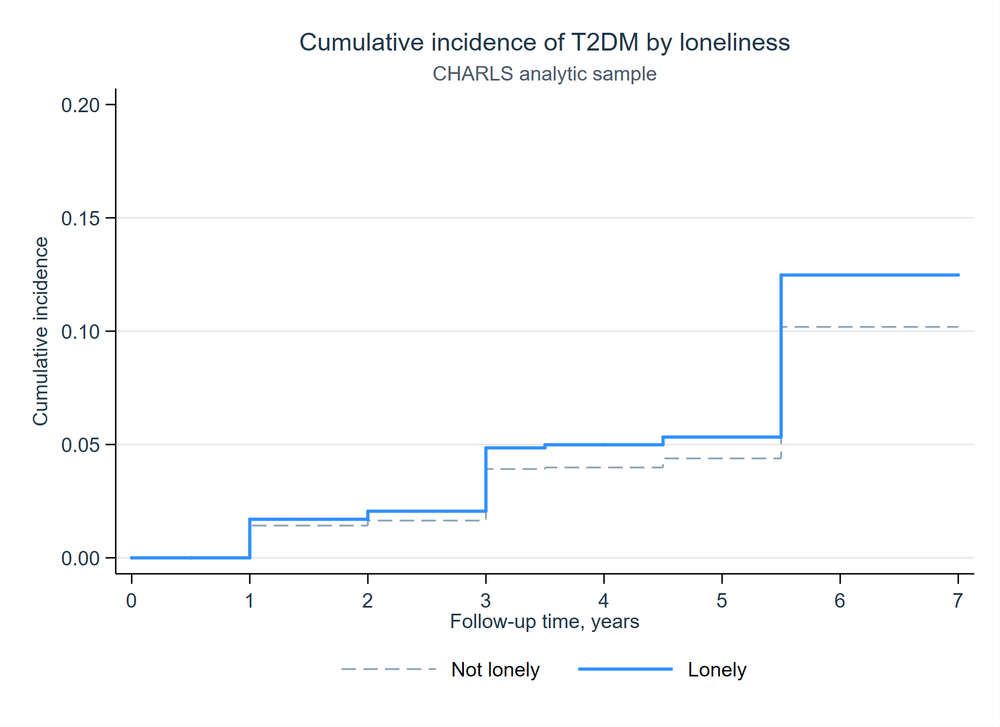
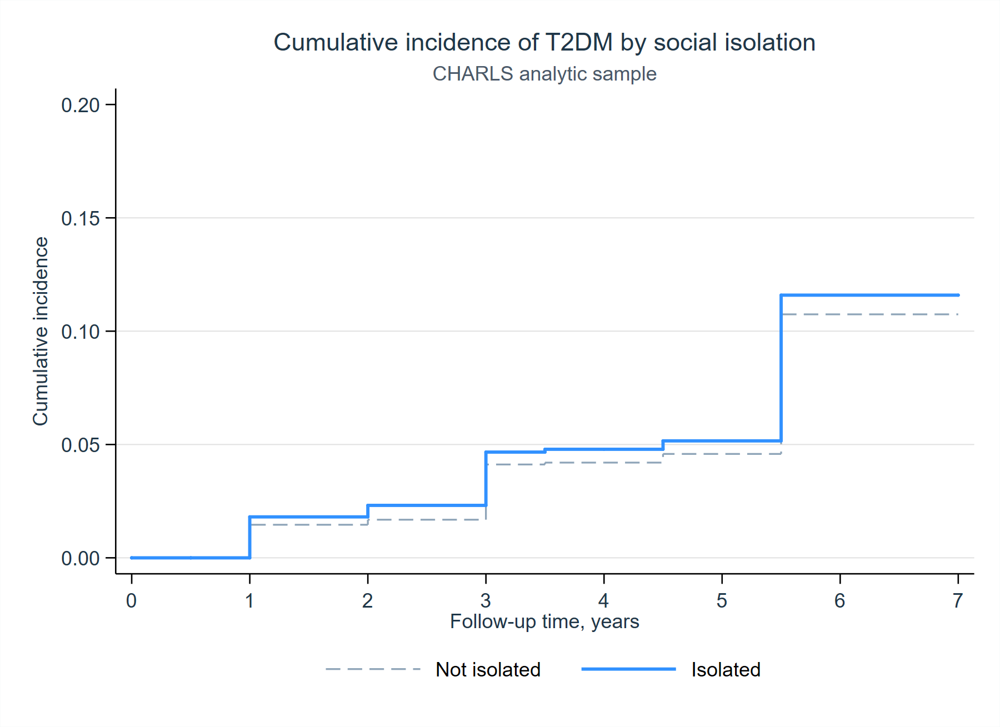

# Summary

This report summarizes a reproducible survival analysis of loneliness, social isolation, and incident type 2 diabetes in the supplied CHARLS analytic dataset. All numerical statements below are backed by `explorations/charls_t2dm_survival/output/tables/` or `explorations/charls_t2dm_survival/logs/01_charls_t2dm_survival.log`.

The analytic sample includes 14,205 participants and 1,295 incident T2DM events, with a mean follow-up of 5.83 years and median follow-up of 7.00 years. Loneliness prevalence is 29.49%, and social isolation prevalence is 13.58%. Source: `output/tables/sample_summary.csv`.

# Main Cox Models

The staged Cox models show that loneliness is positively associated with incident T2DM across all adjustment sets. In the fully adjusted model, the hazard ratio for loneliness is 1.204 (95% CI 1.074 to 1.350; p = 0.0014). Social isolation is not statistically significant in the fully adjusted model (HR 1.115; 95% CI 0.944 to 1.316; p = 0.1990). Source: `output/tables/cox_models.csv`.

In the mutually adjusted fully adjusted model, loneliness remains associated with higher T2DM hazard (HR 1.196; 95% CI 1.066 to 1.342; p = 0.0023), while social isolation does not (HR 1.079; 95% CI 0.913 to 1.275; p = 0.3747). Source: `output/tables/cox_models.csv`.

# Robustness and Sex-Stratified Analyses

The continuous social isolation score is not associated with incident T2DM in the fully adjusted model (HR 1.009; 95% CI 0.936 to 1.086; p = 0.8198). The combined binary indicators show higher hazards for having either loneliness or social isolation (HR 1.166; 95% CI 1.043 to 1.303; p = 0.0071) and for having both (HR 1.308; 95% CI 1.064 to 1.608; p = 0.0108). Weibull models yield similar estimates for loneliness (HR 1.210; 95% CI 1.075 to 1.361; p = 0.0016) and social isolation (HR 1.115; 95% CI 0.940 to 1.323; p = 0.2124). Source: `output/tables/cox_models.csv`.

Sex-stratified fully adjusted models suggest a stronger loneliness association among women (HR 1.287; 95% CI 1.115 to 1.485; p = 0.0006) than among men (HR 1.075; 95% CI 0.884 to 1.306; p = 0.4698). These are subgroup associations, not a formal interaction test. Source: `output/tables/cox_models.csv`.

# Proportional Hazards Diagnostics

Schoenfeld residual tests do not reject the proportional hazards assumption for the main exposure terms. The fully adjusted loneliness model has exposure-specific p = 0.9925 and global p = 0.0914; the fully adjusted social isolation model has exposure-specific p = 0.4626 and global p = 0.0792; the joint model has global p = 0.1096. Source: `logs/01_charls_t2dm_survival.log`, lines around the printed "PH test" blocks.

# Figures





# Manuscript Methods

We conducted a time-to-event analysis using the supplied CHARLS analytic cohort to estimate associations of loneliness and social isolation with incident type 2 diabetes mellitus (T2DM). Follow-up time was defined by `time_t2dm`, and incident T2DM was defined by `event_t2dm`. Participants were stset with one record per `panel_ID`, and survival time was modeled from baseline until T2DM onset or censoring.

The primary exposures were binary indicators for loneliness and social isolation. Additional exposure specifications included the continuous social isolation score, a three-level social isolation score category (0, 1, and 2-4), an indicator for either loneliness or social isolation, and an indicator for both loneliness and social isolation. Covariates were added sequentially to evaluate robustness across adjustment sets. Model 1 adjusted for age and sex. Model 2 additionally adjusted for Han ethnicity, education category, and log household income. Model 3 additionally adjusted for log-transformed total metabolic equivalent task minutes and body mass index. Model 4 additionally adjusted for baseline hypertension, heart disease, dyslipidemia, and stroke. Variables with no variation in the analytic file (`rural_r`, `employed`, `smoke_cur`, and `drink_cur`) were documented but excluded from adjusted models because their coefficients are not identifiable.

We estimated Cox proportional hazards models with robust standard errors and reported hazard ratios with 95% confidence intervals and two-sided p-values. Primary analyses estimated loneliness and social isolation separately across the staged covariate sets; a mutually adjusted model included both exposures simultaneously. Prespecified robustness analyses used alternative exposure definitions and Weibull survival models. We further conducted sex-stratified analyses by estimating fully adjusted models separately for women and men. The proportional hazards assumption was evaluated using Schoenfeld residual tests (`estat phtest, detail`). Cumulative incidence curves by loneliness and social isolation were estimated using Kaplan-Meier methods and exported as publication-ready PDF and PNG figures.

# Reproducibility

Run:

```bash
"C:\Program Files (x86)\Stata15\Stata-64.exe" /e do explorations/charls_t2dm_survival/dofiles/01_charls_t2dm_survival.do
```

Generated artifacts:

- `explorations/charls_t2dm_survival/logs/01_charls_t2dm_survival.log`
- `explorations/charls_t2dm_survival/output/tables/sample_summary.csv`
- `explorations/charls_t2dm_survival/output/tables/baseline_characteristics.csv`
- `explorations/charls_t2dm_survival/output/tables/cox_models.csv`
- `explorations/charls_t2dm_survival/output/figures/km_t2dm_lonely.pdf`
- `explorations/charls_t2dm_survival/output/figures/km_t2dm_lonely.png`
- `explorations/charls_t2dm_survival/output/figures/km_t2dm_isolated.pdf`
- `explorations/charls_t2dm_survival/output/figures/km_t2dm_isolated.png`
